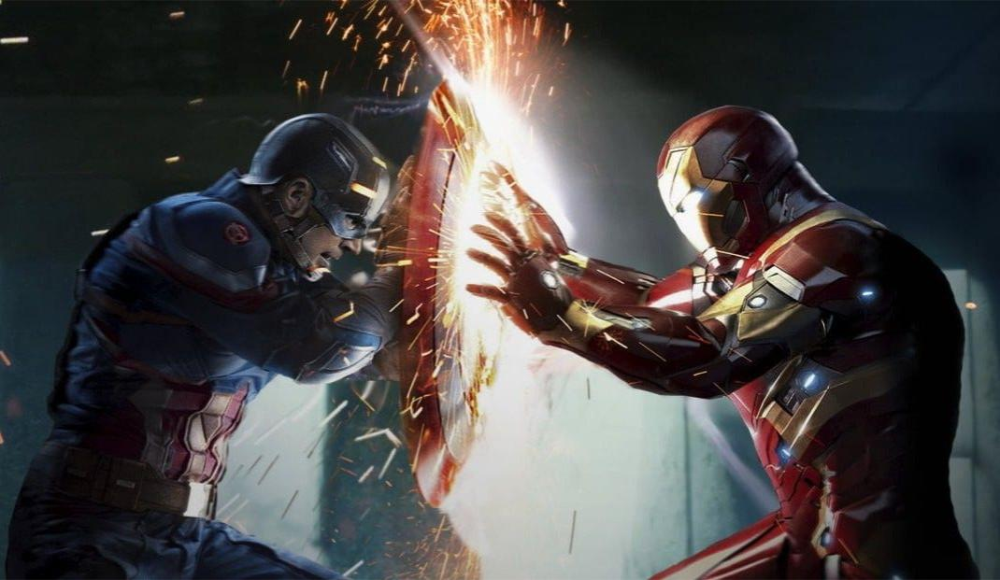
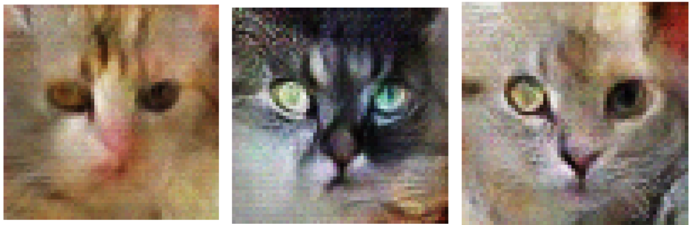

# Cats Generation

This project implements a **Generative Adversarial Network (GAN)** to generate realistic **cat face images** from random noise.  

---

## GANs Overview

In **2014**, Ian Goodfellow published the groundbreaking paper **Generative Adversarial Nets**, introducing **GANs** that caused a revolution in AI-generated content.

###  So what are GANs ???
**GANs (Generative Adversarial Networks)** are a deep learning framework that generates synthetic data by learning from real datasets.  

They consist of two neural networks:
- **Generator (G)**: Creates fake data, initially random, and gradually improves to fool the discriminator.
- **Discriminator (D)**: Evaluates whether data is real or fake.

<p>
  GANs are often described as a <b>"war of bots"</b>:  
      

   - The <b>winner</b> remains unchanged.
   - while the <b>loser</b> updates and improves.  
#### This iterative battle pushes the generator toward producing more realistic data.
</p>


## Model Architecture

### Generator
- **Input:** Random noise 
- **Layers:**
  - Dense → Reshape → Conv2DTranspose layers
  - Batch Normalization
  - LeakyReLU activation
- **Output:** 64×64 RGB image

### Discriminator
- **Input:** Real or fake image
- **Layers:**
  - Conv2D layers for downsampling
  - LeakyReLU activation
  - Dropout for regularization
- **Output:** Scalar probability (real vs fake)

---

##  Training Details

- **Loss Functions:**
  - **Generator Loss:** Encourages G to fool D
  - **Discriminator Loss:** Distinguishes real (label = 0.9 for smoothing) vs fake (label = 0) images

- **Optimizers:**
  - **Adam** optimizer (`learning_rate = 1e-4`) for both G & D

- **Stability Tricks:**
  - Light Gaussian noise added to real images before feeding them to D

- **Training Duration:**
  - **100 epochs**

---
## Results

Example generated cat images after training:

<p align="center">
  
</p>

---

## Dataset

- **Source:** [Cat Faces Dataset (Kaggle)](https://www.kaggle.com/datasets/azmeenasiraj/cat-faces-data-set?utm_source=chatgpt.com)
- **Content:**  cat face images 

---

## Steps to Run

### 1. Clone Repository
```bash
git clone https://github.com/ranazsaad/GANs-Cats_Generation.git
cd GANs-Cats_Generation
```
### 2. Run the Notebook
   - Open GANs_Cat.ipynb in Jupyter Notebook or Google Colab.
---
